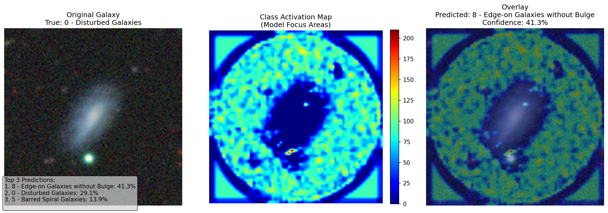

# Galaxy Classifier

E(2)-equivariant CNN for galaxy morphology classification. **83% accuracy** on Galaxy10 DECaLS (17,736 images, 10 classes).



## Why equivariance

Galaxies have no preferred orientation — a spiral galaxy is the same regardless of viewing angle. Standard CNNs learn rotational invariance implicitly through data augmentation; an equivariant network encodes it structurally via the C4 symmetry group, so every feature map transforms predictably under 90° rotations. This reduces the effective hypothesis space and removes the need for rotation augmentation entirely.

The model also takes a physics-based asymmetry score (Conselice 1997) as a secondary input, processed through a small MLP and concatenated before the classifier head.

## Architecture

5 equivariant convolutional blocks (`R2Conv`) with mixed trivial and regular field representations, antialiased average pooling between stages, and group pooling to collapse rotational equivariance into full invariance before the MLP head.

Built with [escnn](https://github.com/QUVA-Lab/escnn).

## Training

- **Loss**: Class-Balanced Focal Loss — computes the effective number of samples per class to reweight the focal term, addressing the ~10:1 imbalance in Galaxy10
- **Optimizer**: RAdam + ReduceLROnPlateau scheduler
- **Hyperparameters**: Optuna with HyperbandPruner, experiments tracked in MLflow

## Preprocessing

Images go through a star removal pipeline before training — bright point sources are detected and masked so the model focuses on galaxy morphology rather than foreground contamination. A per-image asymmetry index is then computed following Conselice (1997) and passed as an auxiliary feature.

## Dataset

Galaxy10 DECaLS — 17,736 labeled images across 10 morphology classes (disturbed, merging, round smooth, barred spiral, edge-on, etc.). [Details](https://astronn.readthedocs.io/en/latest/galaxy10.html)

## Run

> Requires `gcc-fortran` installed system-wide (escnn dependency).

```bash
pip install -r requirements.txt

# Start MLflow before training
mlflow ui --backend-store-uri sqlite:///mlflow.db

# Preprocess: star removal + asymmetry calculation
python src/preprocess_pipeline.py

# Train
python src/traincnn.py
```

Model analysis and Grad-CAM are in `notebooks/model_analysis.ipynb`.

## References

- Cui et al. — [Class-Balanced Loss Based on Effective Number of Samples](https://arxiv.org/abs/1901.05555) (2019)
- Weiler & Cesa — [General E(2)-Equivariant Steerable CNNs](https://arxiv.org/abs/1911.08251) (2019)
- Leung & Bovy — [astroNN / Galaxy10 DECaLS](https://astronn.readthedocs.io/en/latest/galaxy10.html)
- Conselice — [The Symmetry, Color, and Morphology of Galaxies](https://doi.org/10.1086/134004) (1997)
